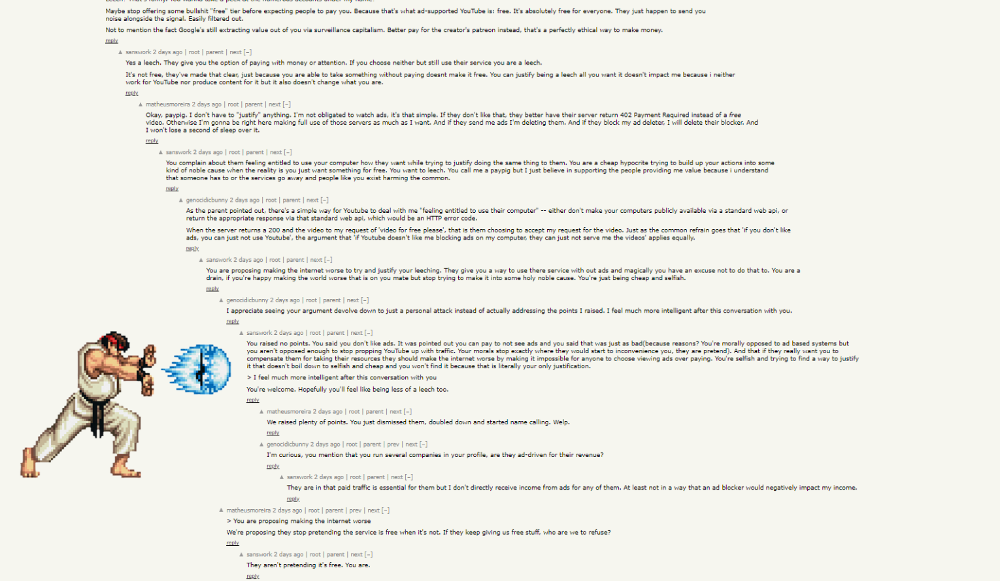

## How I Got Here

Like many of you, I spend too much time being unproductive online. Recently, I've taken to lurking on [Hacker News](https://news.ycombinator.com/) during the day at work and keeping up with what's going on in the world of tech.

Now, Hacker News' UI is pretty barebones, it's definitely not going to win any design awards. But it is functional, it offers a simple experience of reading and commenting on articles and I tend to enjoy the discussions more than the articles themselves.

You might have gathered, since I'm talking about looking at this during the day, that my attention span is a bit iffy at times. Normally, I get distracted, jump into a thread read it to the end and then hop onto my next task. It actually works pretty well for me since it gets me out of my code editor and takes my mind off of the problem I'm working on for a moment.

Where am I going with this? Well, my attention span being what it is, I often feel that certain comment threads on HN get a bit boring after the first couple of replies, not only that it starts to look like callback hell, and it's often impossible to know which level of the thread you're on.



With that problem came my idea for my first browser extension. Help me find the comments I want to read and let me skip the rest.

I know that the majority of the comments that I find interesting are first or second level replies. Beyond that it's usually just people arguing about the same thing over and over again. So, I wanted to be able to jump between the all of the first level comments on the page.

Hacker News Scroller was born. Great, right? I really put a lot of thought into the name.

## How I Built It

It turns out, that it's not actually that hard to make a browser extension. Making a good one is different mind you, but getting your code to run as a browser extension doesn't have much mystery behind it. It is also pretty versatile. Your extension could just be a UI tweak for your favorite website, or it could be a full blown application with service workers, a separate backend, popups for configuration and more.

### Manifest.json

Just like when you have Node.js project, you need a `package.json`, well turns out you need a `manifest.json` file for browser extensions. Here I am strictly talking about Chromium based browsers, but I presume others will need something similar, maybe with a different name.

This `manifest.json` file is very similar to a `package.json file`. It has some important things like the extension name, version and description.

Here's my `manifest.json` file:

```json
{
  "manifest_version": 3, // this is the version of the manifest file
  "name": "Hacker News Scroller", // this is the name of the extension
  "version": "1.0", // this is the version of the extension
  "description": "Read Hacker News comments with ease.", // this is the description of the extension
  "permissions": ["scripting", "tabs", "activeTab", "storage"],
  "content_scripts": [
    {
      "matches": ["*://news.ycombinator.com/item*"], // this is the URL that the extension will run on
      "js": ["index.js"], // this is the content script that the extension will run
      "runs_at": "document_end" // this is when the extension will run
    }
  ],
  "action": {
    "default_popup": "popup.html"
  },
  "options_page": "options.html"
}
```

I built my extension using manifest verison 3, so that's what I'm able to talk about here. It is the newest version and it does bring some important changes compared to older versions.

Check the overview of manifest v3 [here](https://developer.chrome.com/docs/extensions/mv3/intro/mv3-overview/).

### Content Scripts

The most important part of the manifest.json file(for this project) is the content scripts property. That's where we are able to link to the code that the browser extension will run in order to interact with the DOM and content on the page.

Browser extensions follow the same rules as web pages. we use HTML to markup the content, CSS to add styles and JavaScript for the logic. We can also use [WebAPIs](https://developer.mozilla.org/en-US/docs/Web/API) just like we would in a web page. Not only do we have access to JavaScrip WebAPIs in a browser extension but we also have access to [ChromeAPIs](https://developer.chrome.com/docs/extensions/reference/).

### Service workers

Service workers are for interacting with browser events rather than the content of a web page. For example, you can use service worker to listen to a new tab being opened in the browser.

I didn't need to use any service workers for my extension since I didn't need to interact with any of the browser events.

### The rest

We can also use the manifest.json file to add icons for the extension, set permissions and even decide in which browser contexts the extension will run. We can also design our own options pages to let users configure the extension and include it in the manifest.json file. We can also include actions that the user can take on the extension, like clicking a button to open a popup. There's a lot of options and I probably haven't even scratched the surface so the best place to find out is in the Chrome Developer documentation.

## The Code

I decided to use TS in my project which is not necessary but my personal preference when developing. Using TS means that I need to compile my code into JS before I can use it in the browser. I used [Tsup](https://tsup.egoist.dev/) so that I am able to compile and bundle my code into a single file. This is important to reduce the size of the extension and also to make sure that the code is compatible with the browser.

Here's my Tsup config file:

```js
import { defineConfig } from "tsup";

export default defineConfig({
  entryPoints: ["src/index.ts"], // source file
  dts: true, // generate .d.ts bundle
  sourcemap: true, // generate sourcemap
  format: ["cjs"], // output in CJS
  clean: true, // clear the dist folder before each build
  splitting: true, // split output into chunks
  minify: "terser", // minify output using Terser
  watch: process.argv.includes("--watch"), // configure watch mode by passing "--watch" to the CLI
  publicDir: "public", // copy files from "public" folder into dist folder
  legacyOutput: "dist/index.js", // this lets me create CJS with the .js extension instead of .cjs extension
});
```

## Developing the extension

Those of you that work with frontend frameworks that have Hot Module Reload might find the DX of browser extensions a little clunky. Tsup, like tsc, has a watch mode and it builds really quickly. But, that's not the problem. If you want to see the changes you've made in the browser, you need to add load the extension.

First let's go to `Settings -> Extensions -> Manage Extensions`.

Or, click on the extensions icon(in Chrome it's a piece of a jigsaw pizzle) and then `Manage Extensions` at the bottom.

You should now be on the page where you can manage your browser extensions, but you will only be able to interact with your installed extensions.

At the top right, you should see the option to toggle `Developer mode`.

Once you're in developer mode, at the top left, you should now see `Load unpacked`, `Pack extension` and `Update`.

Perfect, click on load unpacked and upload the folder where you have your `manifest.json` and other extension files. If you are doing it like me, or using my template, that should be the `dist` folder.

That's it, you can now see your extension in the browser and try it out. You'll see that you even get some options for debugging here on the extensions page.

But wait..., you haven't finished developing have you? No? Well, time to make your changes in your code. And since you are using Tsup's watch mode all of your changes are being added to your `dist` folder. But your extensions is not changing.

I told you that you would miss HMR.

Now it's time to back to the extensions page, find your extension, and refresh it. Unfortunately, you're going to be in that cycle for the rest of development.

So, it is possible to use HMR with browser extensions, but it would require a little bit of extra set up, that I don't really need. But if you're interested, there is a webpack plugin out there somewhere, and I have also seen a websocket implementation to monitor changes in the dist folder and trigger a reload event in the browser. I'm sure there are other ways too. I really didn't want to bother with Webpack for this. I mean, look at how many lines are in my Tsup config file. Have you seen a webpack config file? It's like a novel. Rollup or Esbuild might have been a better alternative and I'll probably dig a little deeper into using those for browser extensions in the future.

Now, let me clear this up a bit because I was being a little dramatic. You DON'T need to refesh the extension every single time you make a change to the code.

Here's the lowdown:

| File               | Requires Reload          |
| ------------------ | ------------------------ |
| manifest.json      | Yes                      |
| Background scripts | Yes                      |
| Content scripts    | Yes and refresh the page |
| Popup.html         | No                       |
| ! Options.html     | No                       |

### Problems I faced

Skip this section if you're only interested in how to build a browser extension. I'm going to talk a bit about developing my specific extension.

One approach that I took was trying to use a doubly linked list to be able to always go to the next or previous comment.

This approach worked really well, I didn't even need to implement the full functionality of a linked list and I was able to jump from comment to comment with relative ease. But I ran into a small hiccup.

A user may scroll manually with the mousewheel at some point and the next and previous references would be incorrect. I thought about trying to keep the linked list up to date, possibly using an `IntersectionObserver` to detect when the user has scrolled to a new comment. This all made it seem like my simple solution was about to become a very complex one, and that my chosen data structure ([Doubly Linked List](https://en.wikipedia.org/wiki/Doubly_linked_list)) was not the right one for the job.

I went back to my MVP approach and decided to create maps with the y position of each comment as the key and the DOM element itself as the value. This way I could easily find the next comment by getting the next key in the map. This works reasonally however, because y position is a float, I decided to store the floor of the y position in one map, and the ceil in another. This just made it a little easier to find the corresponding comment depending on the direction of the scroll. All I had to do was give the current y scroll position of the window object and the I could get the next and previous comments. I even added a way of highlighting the current comment.

```ts
export class CommentMap {
  #comments: Map<number, Comment>;
  #ceilComments: Map<number, Comment>;
  #floorComments: Map<number, Comment>;

  constructor() {
    this.#comments = new Map();
    this.#ceilComments = new Map();
    this.#floorComments = new Map();
  }

  add(comment: Comment): void {
    this.#comments.set(comment.getY(), comment);
    this.#floorComments.set(Math.floor(comment.getY()), comment);
    this.#ceilComments.set(Math.ceil(comment.getY()), comment);
  }

  get(yPosition: number): Comment | null {
    return this.#comments.get(yPosition) ?? null;
  }

  next(yPosition: number) {
    const commentPositions = Array.from(this.#floorComments.keys()).sort(
      (key1, key2) => key1 - key2
    );

    const nextCommentPosition = commentPositions.find(
      commentPosition => commentPosition > yPosition
    );

    if (!nextCommentPosition) {
      return null;
    }

    const nextComment = this.#floorComments.get(nextCommentPosition);

    if (!nextComment) {
      return null;
    }

    this.highlightCommentParent(nextComment);

    return nextComment;
  }

  prev(yPosition: number) {
    const commentPositions = Array.from(this.#ceilComments.keys()).sort(
      (key1, key2) => key2 - key1
    );

    const previousCommentPosition = commentPositions.find(
      commentPosition => commentPosition < yPosition
    );

    if (!previousCommentPosition) {
      return null;
    }

    const previousComment = this.#ceilComments.get(previousCommentPosition);

    if (!previousComment) {
      return null;
    }

    this.highlightCommentParent(previousComment);

    return previousComment;
  }

  highlightComment(comment: Comment): void {
    const commentElement = comment.getDomElement();

    commentElement.classList.add("hn-highlight");

    setTimeout(() => {
      commentElement.classList.remove("hn-highlight");
    }, 2000);
  }

  highlightCommentParent(comment: Comment): void {
    const commentElement = comment.getDomElement();

    const parent = commentElement.parentElement;

    if (!parent) {
      return;
    }

    parent.classList.add("hn-highlight");

    setTimeout(() => {
      parent.classList.remove("hn-highlight");
    }, 2000);
  }

  public static from(...args: Comment[]): CommentMap {
    const commentMap = new CommentMap();

    args.forEach(comment => commentMap.add(comment));

    return commentMap;
  }
}
```

Take a look at the extension in action:


## Publishing the extension

If you decide you want to publish an extension on the Chrome Web Store the first step is parting with your hard earned cash. Unfortunately, you need to spend €5 to be able to publish an extension. I'm not sure if this is the same for other browsers, but I would assume so. Remember though, even though you are publishing on the Chrome Web Store, your extension will be available on all Chromium based browsers.

Once you've paid your €5, you can go to the [Chrome Web Store Developer Dashboard](https://chrome.google.com/webstore/devconsole/) and create a new extension. You'll need to upload a zip file of your extension. You can create this by zipping up your `dist` folder. You'll also need to upload some screenshots and a logo for your extension and there's plenty of other fields to fill out too.

Once you've done that, you can publish your extension.

## Try it yourself

If you'd like to try building your own extension with TypeScript, then feel free to use my [GitHub template](https://github.com/benjaminrae/ts-chrome-extension-starter). It uses Tsup like in my example. Otherwise, you could always try Parcel or Vite to make one. If you're daring enough, then vanilla JS is also an option.

I'd love to see what you can come up with.

## Links

- [Github repo](https://github.com/benjaminrae/hacker-news-tools-extension)
- [GitHub template](https://github.com/benjaminrae/ts-chrome-extension-starter)
